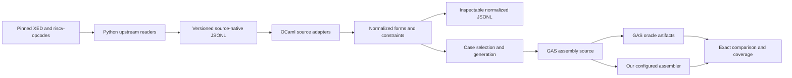

# Using the captured ISA data: review and implementation plan

Review date: 2026-09-05. Repository baseline: `b659f3eaa253e45c0535472baacc3cc4fc806350`.
Status: investigation complete; implementation stages below are proposed.
Execution status and individual work packages live in
[isa-consumption-tracker.md](isa-consumption-tracker.md).

## 1. Recommendation and scope

Build an OCaml consumer of the existing XED and riscv-opcodes captures,
with source-specific typed adapters, an inspectable common representation,
and a common differential-test runner. Python should call upstream readers
and preserve their facts; OCaml should own architectural interpretation,
feature mapping, syntax recipes, selection, and generation policy.

Start with small, complete paths from captured record to GAS source to
exact byte comparison. Use those paths to establish the representation
before expanding it to difficult instruction families. Refactor the
assembler after establishing this independent regression evidence, first
by extracting components without changing behavior, then by enforcing
selected features throughout the public assembly paths.

Keep XED and riscv-opcodes as the only ISA ingestion sources throughout
this plan. There is currently one source per architecture family, not two
independent descriptions of each ISA. Therefore, we can establish common
generation machinery now, but cannot yet demonstrate reconciliation of
conflicting sources for the same instruction. GAS remains the independent
encoding oracle. Consulting its manual to understand accepted syntax is
part of using that oracle, not a new ISA database adapter.

“Completion” needs two explicit meanings:

* **Capture/consumer completion:** every selected source record is accounted
  for, preserved, and either normalized or given a specific unresolved
  reason. Every generation-capable family has a bounded coverage policy.
* **Assembler support completion:** every form in a declared support slice
  passes its acceptance gates. Capturing an extension does not declare the
  assembler implements it.

Stage 7 closes the first meaning and all explicitly selected support slices.
It does not claim all of modern x86 and RISC-V are implemented. Remaining
extensions stay visible in the backlog. Adding another ingestion source
requires a subsequent scope decision after that review; completion of the
older capture plan alone is no longer the trigger.

This plan follows [isa.md](isa.md), [isa-database-design.md](isa-database-design.md),
and [asm_plan.md](asm_plan.md). It refines their division of responsibilities:
retain the independent Python capture producer, move further semantic
unification to OCaml, and keep producer/tool dependencies outside the
portable assembler. The earlier decisions to retain checked-in JSONL and
the coarse XED compatibility lane remain useful.

## 2. What exists today

### 2.1 Recent changes and capture paths

The recent sequence added the riscv-opcodes upstream reader (`c17355a`),
JSONL exports (`4da3344`), inventory cross-validation (`cadf657`), operand
vocabulary (`5781006`), XED's mbuild dependency (`c56031a`), the stronger XED
reader (`1b5a21e`), resolved XED exports (`3b55677`), and a standalone
cross-validation target (`b659f3e`).

The [source lock](../isa-db/sources.lock.json) records XED commit
`0bcb6237345c5066726dcc08b3d87928df3b5b26`, riscv-opcodes commit
`7afd3dc8772909d8c94ceeb208467cff93896396`, and mbuild commit
`1b437e409221a2b5703b4d8896baa20d43e4ba1a`. The checked-out commits matched
these during this review. Commit identity is the reproduction authority;
release labels alone are insufficient.

| Capture | Actual process | Preserved data | Important limitations |
|---|---|---|---|
| RISC-V | Local line parser retains source locations and relationships; upstream `create_inst_dict` runs per extension file and resolves fields/imports/pseudos | Mnemonic, source file/line, extension file, mask/value, operand bit ranges, import/specialization references | Field positions are not assembly operand semantics; applicability is unconditional within a prefiltered profile; relationships lack exact target record IDs |
| XED coarse | Recursively scans `datafiles` instruction blocks, including root files | ICLASS, raw pattern information, directory group, EXTENSION and mode expression | Opaque encoding; no resolved operands; UDELETE suppression is not applied |
| XED resolved | Runs `mfile.py just-prep`, then `gen_setup.read_db` / `read_xed_db.xed_reader_t`; memoizes the parse in-process | ICLASS/IFORM, ISA_SET/EXTENSION/category, space/map/opcode, expanded pattern, parsed operands and visibility, mode expression | Selected projection of upstream objects; no original file/line or directory group; no complete byte-encoding or GAS syntax recipe |
| RISC-V vocabulary | Reads upstream's live `arg_lut`, including hardcoded/generated additions | Operand name and bit range | No register classes, signedness, immediate reconstruction, or syntax |

See the actual adapters in [isa-db/README.md](../isa-db/README.md),
[RISC-V reader](../isa-db/adapters/riscv_opcodes/reader.py),
[XED wrapper](../isa-db/adapters/xed/upstream.py), and
[XED resolved mapper](../isa-db/adapters/xed/upstream_reader.py).

RISC-V profile exports select top-level `rv_` plus `rv32_` or `rv64_`
extension files; the nested unratified directory is excluded. This is
selection by the pinned tree's layout, not an independent certification of
ratification status. XED's `x86_32` export includes forms applicable in
**either 16-bit or 32-bit mode**. It cannot be sent wholesale to GAS `--32`.
Keep execution mode separate from export filename, operand size, and
address size.

XED's resolved reader honors UDELETE and version deletion. Keeping the
coarse export alongside it is necessary for the existing directory-group
inventory contract: the resolved aggregate does not preserve that group,
and joining by ICLASS or ICLASS plus EXTENSION is ambiguous. Coarse and
resolved records must not be counted as two independent ISA authorities.

### 2.2 Measured export baseline

Counts below were computed from the checked-in JSONL at the baseline,
not inferred from documentation. Profiles overlap and must not be summed
to claim a unique architecture-wide form count.

| Export | Records | Record breakdown | Distinct native names |
|---|---:|---|---:|
| `riscv_opcodes/riscv32.jsonl` | 1,089 | 796 instruction forms, 181 pseudos, 112 imports | 957 |
| `riscv_opcodes/riscv64.jsonl` | 1,154 | 871 instruction forms, 148 pseudos, 135 imports | 1,010 |
| `xed/x86_32.jsonl` | 6,376 | Coarse instruction blocks, all opaque | 1,815 |
| `xed/x86_64.jsonl` | 9,040 | Coarse instruction blocks, all opaque | 1,975 |
| `xed_resolved/x86_32.jsonl` | 7,887 | Resolved forms | 1,806 |
| `xed_resolved/x86_64.jsonl` | 10,571 | Resolved forms | 1,967 |
| `riscv_opcodes/arg-lut.jsonl` | 124 | Vocabulary entries | — |

The resolved x86-64 export contains 1,956 legacy, 1,664 VEX, 6,775 EVEX,
and 176 XOP records, spanning 284 distinct native ISA_SET labels. These
labels are not 284 independently selectable product extensions. The
resolved x86 exports total about 23.4 MB in decimal units; normalized
exports and test matrices should be sharded rather than repeatedly
duplicating this entire payload per case.

### 2.3 Current use is inventory consistency, not encoding verification

[Isa_db_jsonl](../asm/tools/lib/isa_db_jsonl.ml) decodes only record ID,
source, kind, native name, and provenance extension/group. It skips
encoding, applicability, operands, relationships, snapshot, and unresolved
details. [Isa_db_cross_validate](../asm/tools/lib/isa_db_cross_validate.ml)
checks that every existing manifest pair has some matching export record.
Imports are excluded. XED is matched by lowercase name plus directory
group; RISC-V by native name plus extension file.

This is a one-directional containment check. It does not validate the
richer export, establish form coverage, or prove that GAS or our assembler
can process an instruction. The existing OCaml inventory readers still
produce the authoritative compatibility manifests.

### 2.4 Existing differential scaffolding worth reusing

| Existing path | Input source and assertion | Reuse and boundary |
|---|---|---|
| `asm/test/snippets` and `asm/tools/lib/gas_xref_cmd.ml` | Project-owned AST snippets print `.s`; GAS produces recorded bytes | Reuse artifact and tool-process patterns; a new source-driven generator must not merely enumerate our own implemented instructions |
| `asm/test/xref/test_xref.ml` | Reassembles recorded snippet/helper/CompCert-runtime sources; compares with GAS artifacts | Reuse offline replay and supported/frontier distinction; current frontier has special ARM relocation masking and is not a general exact relocation oracle |
| `asm/tools/lib/oracle_cmd.ml`, `asm/test/differential` | CompCert fixtures, object relocation evidence, controlled GNU links, image comparison | Reuse controlled addresses, symbol/section evidence, and linked-image comparison for relocatable tests |
| `asm/test/coherence`, `asm/test/lib/codec` | Direct AST paths and codec encode/decode properties | Reuse as internal consistency checks, alongside independent GAS evidence |
| `asm/test/oracle` | Freestanding execution and ABI controls | Retain for executable behavioral slices; encoding tests for arbitrary ISA forms do not require execution |

The existing GAS frontier runtime discovery misses RISC-V because it looks
for target-named directories while CompCert uses `runtime/riscV`. This is
an existing coverage limitation, not a blocker for the new generator.
Several old comments still describe the initial 24-form assembler; use
current code and measured fixtures when establishing coverage.

### 2.5 The assembler is modular between families, concentrated within them

There are shared family functors and thin 32/64-bit instantiations, plus
separate encoding and text frontend libraries. At this baseline:

| Family file | Lines | Responsibilities |
|---|---:|---|
| `x86_family_encode.ml` | 4,448 | Registers/operands/opcodes, instruction types, normalization, lowering, encoding alternatives, decoding, fixups, padding |
| `x86_family.ml` | 499 | Text operands, lexical behavior, directives |
| `riscv_family_encode.ml` | 1,977 | Types, normalization/lowering, explicit encoding/decoding, codec wrapper, fixups |
| `riscv_family.ml` | 171 | Text operands and directives |

X86 constructs one composite `Codec.choice`, with shared alternative
builders and a large inline list. Existing x87 instructions already live
in that file alongside integer and SSE instructions: this is a real
extraction opportunity, not a proposal to introduce x87 from scratch.

RISC-V is different: its exposed codec is primarily `word` and `pair`
alternatives wrapping explicit encoder/decoder functions. A codec dump
therefore cannot serve as a complete instruction-form inventory. A design
that assumes every ISA already has one declarative row per form would fail.

[Target_encode.ENCODE](../asm/lib/target_intf/target_encode.ml) already has
`feature`, `default_features`, and a feature parameter for simplification.
Both families use `No_features` and ignore feature selection. The
[pipeline](../asm/driver/pipeline.ml) supplies `T.default_features`, and
the erased [driver interface](../asm/lib/target_intf/target.ml) has no
caller configuration parameter. RISC-V threads option state for PIC,
relaxation, RVC and push/pop; x86 state is a placeholder. RISC-V's
`.attribute` is accepted as ignored object metadata. Feature support needs
API and state propagation work, not just a filter on the final codec list.

## 3. Capture defects and gaps to resolve before broad generation

### 3.1 Confirmed RISC-V width bug

`_instruction_width_bits` returns 16 only when the extension filename has
an underscore-separated component exactly equal to `c`. Thus `rv_c` works,
but compressed instructions in `rv_zcb`, `rv_zcmop`, `rv_zcmp`, `rv_zcmt`,
and other Zc files are labeled 32-bit.

The baseline exports contain **31 affected records in RV32 and 29 in
RV64**, counting records with fixed low bits different from `11` but
`width_bits = 32`. These are per-profile counts, with overlap. For example,
the exported `c.zext.b` in `rv_zcb` has this incorrect width. A scratch
probe with installed RISC-V GAS 2.44:

```sh
printf '.text\nc.zext.b a0\n' > input.s
riscv64-linux-gnu-as -march=rv64i_zca_zcb -mabi=lp64 -mno-relax -o input.o input.s
riscv64-linux-gnu-objcopy -O binary --only-section=.text input.o text.bin
```

produced `61 9d`, exactly two bytes. The producer's 47 tests nevertheless
pass. Fix width inference from instruction encoding facts with explicit
handling of unknown lengths; do not replace one filename heuristic with
another. Do not assume the textual upstream encoding-string length is the
instruction length without checking its representation of compressed words.
Add invariant checks and GAS-backed examples covering both C and Zc.

### 3.2 Source fields are not semantic assembly operands

* RISC-V `sw` lists `imm12hi, rs1, rs2, imm12lo`. GAS wants
  `sw rs2, offset(rs1)`: two encoding fields become one signed immediate,
  and textual order/grouping differ from field order.
* `beq` needs branch displacement reconstruction, alignment and a PC/label
  policy; the bit range names alone do not describe the permutation of
  immediate bits.
* `c.addi` has a tied source/destination, excludes register zero, and uses
  a split nonzero immediate. Enumerating unrestricted fields produces
  invalid/reserved combinations.
* `fadd.s` uses `rd/rs1/rs2` names too, but they denote floating-point
  registers, with a rounding-mode operand. The vocabulary does not state
  that distinction.
* XED `ADD_GPRv_IMMz` provides `GPRv_B`, `SIMMz()` and operand metadata.
  Those are native lookup/encoding concepts, not a GAS string or a complete
  width domain. A parsed operand's `bits` value must be interpreted using
  its native type; it is not universally a literal machine operand value.

Missing facts need explicit, reviewed OCaml interpretation rules, with
links to their evidence. Some necessary interpretation will remain manual:
neither of these sources is a complete GAS grammar. Unknown constructs
must be reported, never silently treated as unconstrained or dropped.

### 3.3 Preserve more native facts without moving interpretation into Python

The existing shared Python `SourceRecord` already performs some
normalization: encoding tags, width inference, mode-expression conversion,
profile filtering, and relationship shaping. Preserve it as a compatibility
format while adding a versioned source-native capture contract.

For RISC-V, preserve raw line/tokens, file identity, upstream encoding,
mask/match, variable_fields, upstream extension memberships, and operand
vocabulary. Retain explicit imports and pseudos beside resolved entries.
CSR names can later come from the already-vendored CSVs when CSR syntax is
the active consumer; causes tables should wait for a demonstrated need.

For XED, preserve the existing resolved fields and audit upstream fields
currently omitted by `_operand_dict`/`source_records`: attributes, CPUID
groups, native mode restriction, effective operand/address-size facts,
width vocabulary, and relevant operand/type metadata. Export these as
native JSON values or referenced auxiliary tables. Preserve lookup names
even when their interpretation is not implemented. Do not dump arbitrary
Python object internals, object addresses, or a fabricated unified prefix
model. Identify which relationships to lookup tables are actually needed
by the first form families before expanding the capture.

The richer path still does not preserve original XED file/line. Either
recover a verified upstream mapping during aggregation or retain the
aggregate origin, record fingerprint, and explicit missing-origin status.
Never assign a directory group using an ambiguous mnemonic join.

### 3.4 Reproducibility and validation gaps

The writer uses the lock's commit to label snapshots but does not enforce
that it matches the tree it reads. A label can therefore be stale. Capture
must verify source/build-dependency commits and record input hashes,
producer revision, selection/build options and schema versions. Define
dirty-source behavior explicitly: refuse release regeneration, or label a
development snapshot using content hashes instead of claiming a clean pin.

The JSON schema checker is a minimal structural check, not full JSON
Schema validation. The shared schema remained v1 when the x86 encoding
variant was added. Additive variants can still break exhaustive consumers;
new source-native and normalized contracts need explicit versions and
unknown-variant diagnostics.

RISC-V IDs contain line numbers; resolved XED IDs contain occurrence
counters in upstream iteration order. These are snapshot-local references,
not reliable cross-update logical identities. Keep them as evidence keys,
add fingerprints and reviewed migration mappings, and detect ambiguity.
Resolve import/specialization references to exact records where possible;
cross-profile references may require the full captured source index.

## 4. Proposed data and ownership boundaries



### 4.1 Three data layers

1. **Source capture:** source identity, snapshot, native payload, source
   locations, references, selection and omissions. Python owns faithful
   serialization and upstream invocation. Existing compatibility exports
   remain available during migration.
2. **Normalized ISA model:** OCaml owns form identity, architectural
   operand domains, constraints, feature requirements, syntax mappings,
   and links to supporting source facts. Its JSONL serialization is a
   first-class inspection artifact, with round-trip and deterministic
   regeneration tests.
3. **Test cases and observations:** concrete operand assignments, source
   rendering, selected configuration, GAS invocation, intended/observed
   form, bytes, verdict, coverage obligations and reproduction metadata.
   Implementation-support status belongs here or in an adjacent reviewed
   support manifest, not in immutable source facts.

Use separate source-specific OCaml decoders such as `Xed_capture` and
`Riscv_opcodes_capture`, then normalize into a small shared model. Retain
source-specific payloads and `Unknown` constraints when a common type
cannot express something yet. Reuse Jsont; do not force the deliberately
narrow inventory reader to become the complete consumer in one change.

Initially put the pure normalization/generation library adjacent to
`asm/tools`, with host I/O and GNU invocation in tooling modules. Production
target libraries must not read JSON files, import producer modules, or
invoke tools at runtime. If small feature/form descriptor types later need
to be shared with production, extract a pure dependency below both users.

### 4.2 Minimum normalized contract

| Entity | Required information |
|---|---|
| Form | Stable project form ID; architecture; source references; execution-mode/XLEN predicates; encoding variant; concrete versus alias/expansion status |
| Operand | Semantic name/role, register class or immediate/memory kind, width expression, explicit/implicit status, signed range, alignment, exclusions, tied operands |
| Encoding | Tagged architecture-specific facts: fixed bits and bit-slice mappings for RISC-V; x86 space/map/opcode and structured constraints as understood, preserving remaining native patterns |
| Requirement | `All`, `Any`, `Not`, native feature, mode/XLEN/size predicates, operand constraints, `Unknown` with evidence |
| Syntax recipe | Dialect, mnemonic/suffix/prefix rules, operand order/grouping, optional or implicit operands, decorators, alias or expansion recipe |
| Feature | Source namespace/name, reviewed project mapping, version if known, dependencies/conflicts, separately scoped GAS spelling/probe |
| Diagnostic | Source/form ID, normalization rule, unresolved fact and affected operations, evidence, associated task |

Do not model all ISAs as a fixed opcode plus a list of numeric fields.
Share the case scheduler, domain sampling, requirement evaluator, results,
artifact writer and comparator. Keep memory rendering, bit transforms,
prefix/decorator policy and pseudo expansion in architecture-specific modules.
Normalize an operand domain only as far as a real generator consumes it.

Use three-valued evaluation: known true, known false, unknown. Automatic
positive generation requires known-true constraints. Unknown is a coverage
gap, not permission to generate arbitrary operands. Preserve OR requirements:
an imported instruction available through alternative extension sets must
not accidentally require every importing extension at once.

The normalized JSON should expose source references and rule IDs for derived
claims. Schematically, `sw` becomes three semantic operands (`value`,
`base`, `offset`), a signed 12-bit offset domain and slice mapping, plus
the syntax recipe `sw value, offset(base)`. Its original four field tokens
remain reachable through the source record. This makes a wrong transform
inspectable without reverse-engineering the generator.

### 4.3 Migration

Introduce source-native and normalized contracts alongside existing lanes.
Read current exports for the initial supported subset, then add native
fields where the consumer demonstrates loss. Generate normalized dumps
from OCaml, and compare selected compatibility projections with the old
inventory. Explain intentional differences, especially XED deletion and
16-bit-mode handling. Retiring the coarse lane or replacing the inventory
generators is a separate milestone with its own mapping and diff evidence;
neither is required to deliver the first differential tests.

## 5. Generating useful GAS verification

### 5.1 Two independent assertions

Each generated case must establish both:

1. GAS assembled the intended form or a documented canonical alternative.
2. Our assembler produced exactly the corresponding bytes under the same
   mode, feature and layout configuration.

Byte equality alone does not prove form coverage. GAS may select an
accumulator-special opcode, a short immediate, a compressed instruction,
or another vector prefix for the generated spelling. Retain intended and
observed form identities and distinguish canonical-spelling tests from
forced-encoding tests. Check RISC-V width and fixed mask bits against GAS
output. For x86, use reviewed byte-structure/form checks for supported
families; disassembly text alone is not a universal form identifier.

Do not generate both an encoder and its expected bytes from the same
normalized record and call that independent verification. Source-derived
mask checks, our encode/decode round trips, and direct AST coherence are
additional assertions; GNU's bytes remain the differential reference.
`.byte`, `.word`, and raw `.insn` probes may diagnose capture facts, but
must not count as named-instruction syntax/encoder coverage.

### 5.2 Operand variation policy

Avoid an unconstrained Cartesian product. For every supported form family,
declare a finite set of mandatory obligations and then optional seeded
sampling:

* Registers: representative classes, low/high encodable registers,
  fixed/implicit registers, ties, legal aliasing and special base/index cases.
* Immediates/displacements: zero when legal, positive/negative interior
  values, endpoints, adjacent encoding-choice boundaries, and separate
  out-of-range/alignment negatives.
* Memory: register indirect, base plus displacement, indexed/scaled forms,
  special bases, address-size variants and symbolic/RIP-relative forms
  where that family supports them.
* Modes/features: each relevant mode, enabled and disabled requirements,
  minimal valid dependency sets, conflicts and selected interactions.
* Syntax: canonical spelling first; aliases, omitted defaults, suffix
  alternatives, decorators and pseudos as separately identified cases.

Exhaust small domains when practical; use boundary representatives and
constrained pairwise coverage for large interacting domains. Add explicit
three-way or higher-order obligations where encoding rules require them.
Publish the policy, seed, budgets, obligations reached and unsatisfied
constraints. Count forms and obligations as well as cases.

### 5.3 Architecture-specific challenges

**RISC-V:** distinguish XLEN from instruction length; reconstruct split
and permuted immediates; enforce compressed register subsets and nonzero
constraints; handle loads/stores, rounding modes, CSR names/numbers,
atomic ordering suffixes, vector mask/group restrictions and pseudo
expansions in dedicated recipes. Extension filenames are evidence, not
automatically valid `-march` components or a complete dependency graph.

Use explicit `-march`, `-mabi`, and no-relax configuration, with matching
linker policy. Prevent opportunistic compression in baseline 32-bit form
tests and enable it deliberately in compressed suites. Source-local
option changes need recorded scope. These are separate GNU controls; see
[RISC-V options](https://sourceware.org/binutils/docs/as/RISC_002dV_002dOptions.html)
and [RISC-V directives](https://sourceware.org/binutils/docs/as/RISC_002dV_002dDirectives.html).

**X86:** start with the AT&T syntax already used by the project. Operand
reversal is not universal; mnemonic suffixes and implicit operands require
form-aware rules. X87 needs its own memory-size and stack-operand syntax
handling. GNU documents both order exceptions and x87 mnemonic differences
in [syntax variations](https://sourceware.org/binutils/docs/as/i386_002dVariations.html)
and [instruction naming](https://sourceware.org/binutils/docs/as/i386_002dMnemonics.html).

Cover operand/address-size overrides, REX and high-byte restrictions,
ModRM/SIB special cases, immediate sign extension and alternative opcodes
before expanding to VEX/EVEX/XOP. Vector forms add register widths, masks,
zeroing, broadcast, rounding/SAE, tuple-dependent displacement scaling and
feature combinations. Do not infer these solely from IFORM spelling.

GNU offers encoding preferences such as `{vex}`, `{evex}`, `{disp32}` and
`{noimm8s}` in its [instruction naming documentation](https://sourceware.org/binutils/docs/as/i386_002dMnemonics.html).
Probe the installed version and our parser before using them in shared
source tests. Prefer operand choices that select an unambiguous form;
otherwise mark the forced form unavailable until the syntax or a separate
direct-AST test path exists. A direct-AST comparison is valuable but must
not be reported as identical-source syntax coverage.

### 5.4 Oracle execution and artifacts

Add a separate corpus such as `asm/fixtures/isa-generated/`; existing
`gas-xref regen` recreates its own tree and should not own this corpus.
Reuse `Gnu_tools`, process supervision, temporary workspaces, hex handling,
controlled links and image binding. Extend tool configuration to accept
per-suite features rather than changing the frozen CompCert target flags.

For each case retain source IDs/snapshots, normalized form/rule IDs,
concrete operands, exact `input.s`, resolved configuration, tool versions
and argv, GNU diagnostics, bytes, relocation evidence, comparison mode,
and expected/actual outcome. Shard by architecture/profile/family with a
manifest for discovery. Preserve useful normalized differences while
removing temporary paths and timestamps from committed identities.

Begin with relocation-free instructions in `.text`, with explicit section
selection and case boundaries. Inspect relocation tables and fail if a
supposedly relocation-free case contains one. Never compare unresolved
object placeholders with our bound image. Later, link GAS objects at the
same controlled addresses as our image, compare complete relevant sections
and symbol/fixup observations, and validate relaxation policy. Do not
generalize the old frontier's word-masking exception into the new gate.

For throughput, batching is acceptable only with per-case symbols/offsets,
clear padding accounting, and automatic reduction to an individual failure.
Small initial fixtures are preferable until those boundaries are proven.

Use three execution tiers:

* Offline consumer tests: committed captures, normalized fixtures and GNU
  artifacts; no Python, upstream preparation, toolchain, or QEMU required.
* GNU regeneration/integration: explicit tool capability matrix, generation,
  assembly/linking and artifact-diff checks; required suites fail if their
  tools are missing.
* Producer/update validation: pinned upstream readers, fresh source export,
  full normalization accounting and upgrade report. Run separately from
  ordinary portable assembler tests.

The available tools measured here are host GAS 2.44, RV32 GAS 2.43.1 and
RV64 GAS 2.44. Native XED feature names and current online GNU option lists
do not imply support in these installed tools. Record capability probes;
consult [GNU x86 options](https://sourceware.org/binutils/docs/as/i386_002dOptions.html)
for the architecture/extension selection contract.

### 5.5 Outcomes and failure controls

Maintain independent fields for normalization, generation, oracle outcome,
implementation expectation and comparison verdict. Avoid one overloaded
“supported” flag.

| Situation | Required treatment |
|---|---|
| Promoted positive case, both accept and bytes agree | Pass; credit only the observed form/obligations |
| Both accept and bytes differ | Hard failure, including frontier cases |
| Our assembler rejects a promoted case | Regression |
| Our assembler rejects an explicitly unimplemented form | Tracked frontier gap; no positive coverage credit |
| GAS rejects a supposedly valid case | Investigate recipe, constraints, flags or tool capability; never blanket-skip |
| Form requires a known unavailable GAS capability | Explicit oracle-unavailable state with probe/version evidence |
| Unknown normalization constraint | Block generation of positive cases and record the missing rule |
| Negative case is accepted unexpectedly | Failure according to the specific negative assertion |

Before trusting a new runner, demonstrate detection of a deliberately
changed expected byte, an unexpected relocation, a wrong-mode case, a
missing required feature and a GAS form-selection mismatch. Mutate scratch
artifacts or synthetic controls, not committed golden files. Rejection
diagnostics need stable categories, not complete GNU error-text matching.

## 6. Component and feature design

### 6.1 Separate components from enabled capabilities

A component is an OCaml implementation boundary; a feature is an
architectural predicate. Their relationship is many-to-many. XED directory,
EXTENSION, ISA_SET, CPUID expression and encoding space are distinct facts.
Similarly, a RISC-V import can make an encoding available through several
extension combinations. Do not turn directory names into runtime switches.

Start with modules in the existing family libraries, then consider separate
linkable libraries only when packaging requires them. Suggested boundaries:

* X86 shared types/registers/addressing/prefixes/fixups; integer/control;
  x87; SSE/SSE2; later vector encoding machinery and individual feature groups.
* RISC-V shared types/immediate transforms/fixups; base integer; M; A;
  F/D; compressed; CSR/system; later bit manipulation and vectors.

Keep shared typed instruction representations initially. Contributors can
return typed alternative lists and form descriptors using a family context
module; the family composes them explicitly. A file split does not require
an extensible untyped instruction AST, dynamic plugins or a new DSL.
RISC-V also needs composable explicit encode/decode dispatch or gradual
conversion to real per-form codecs; choose after measuring the first split.

Every descriptor needs a stable form ID, requirements, component identity
and known source mappings. Preserve one-to-many mappings and shared
encodings. Keep table ordering/selection priority deterministic and test
collisions across component boundaries. Preserve current form IDs and
bytes during extraction, or record deliberate ID migrations separately.
`Codec.check` is useful, but opaque function nodes and RISC-V's wrappers
mean it is not a proof of complete or nonoverlapping architectural coverage.

### 6.2 Effective configuration must reach every path

Introduce a typed family configuration containing execution mode/XLEN,
enabled features with dependency closure, and encoding policy. Keep syntax,
ABI, privilege/execution environment and tuning separate from ISA features.
The assembler need not run an instruction to encode it, so availability
must not be inferred from the host CPU or QEMU.

Retain the current target-name registry and default behavior via wrappers.
Expose validated configuration through the erased driver and CLI, then
portable bindings. Resolve external feature names once at that boundary;
unknown names, unsupported versions and contradictory selections are errors.
Document whether disabling a required dependency rejects the configuration
or removes dependents; use one consistent policy. Prefer an error for an
explicitly contradictory request.

Thread effective configuration through simplification, lowering, alias/pseudo
expansion, encoding alternative selection, relaxation and padding. Existing
direct normalized/lowered AST callers must not bypass feature checks.
Because `encode` currently lacks a configuration argument, stage 6 must
either add one or expose a configured encoder/codec value whose operations
close over validated configuration. Do not rely on text-frontend checks.

Replay local directives in source order and retain configuration with
lowered fragments where layout needs it. Each unit of `assemble_many`
starts with the caller's initial state, so one file's directives cannot
leak into another. Decide how disassembly behaves: a strict configured
decode path should reject disabled forms; an explicit inspection mode can
decode them and report unmet requirements. It must not masquerade as an
instruction that can round-trip under the strict configuration.

RISC-V `.option` push/pop provides existing state machinery to extend.
Do not silently reinterpret ignored `.attribute arch` metadata as a new
feature-selection directive without a documented compatibility decision.
X86 `.arch` needs an explicit support policy; configuration by API/CLI can
precede full directive compatibility.

Define compatibility defaults from actual existing accepted instructions
and fixtures, then pin them. Keep “feature recognized”, “feature partially
implemented”, “enabled” and “fully covered” separate. A default configuration
preserving today's subset must not advertise whole-extension completeness.

### 6.3 First modularity demonstrations

Use existing RISC-V M instructions and existing x86 x87 instructions.
First extract their implementations with no byte or diagnostic changes.
Then prove that enabling them permits the same cases, disabling them gives
an unmet-feature diagnostic, and unrelated base instructions still pass.
Repeat through text and direct AST paths. Add a dependency-sensitive case,
local push/pop, multi-unit isolation, decode policy, and feature-safe
pseudo/relaxation/padding checks before calling feature support complete.

## 7. Staged delivery and acceptance gates

The stages are a dependency order, not a request for a large rewrite.
Each can land as several reviewable changes. Commands described as
“proposed” below do not exist yet; concrete command names must be fixed
in the associated work package before implementation closes.

| Stage | Deliverable | Verifiable exit gate | Dependencies |
|---|---|---|---|
| S0 — Baseline | This review, counts, measured failures, work packages | Reproduce producer tests, inventory check and width finding; implementation status remains separate | Complete in this document |
| S1 — Trustworthy capture | Width fix; versioned native capture contract; pin/content checks; loss/unknown report; exact source relationship indexing | Correct all measured compressed widths; preserve upstream facts; deterministic fresh-process exports; deliberate pin/schema/field corruption is detected; existing compatibility inventory still explained | S0 |
| S2 — OCaml interpretation | Source decoders, minimal normalized model, rule provenance, normalized JSONL and accounting | Every selected record accounted for; exact-reference or explicit unresolved relationships; deterministic dump round trip; unknown predicates never pass; worked RISC-V and XED normalization fixtures | S1 contract; prototype can start from existing exports |
| S3 — Two complete differential slices | Common case generator/runner plus RISC-V base and x86 legacy recipes | At least one mandatory legal case for every form in the frozen pilot manifest; all declared boundary obligations met; GAS intended-form evidence and exact bytes pass; injected failures detected; offline replay works | S2 minimum model |
| S4 — Difficult forms and bounded expansion | Split immediates/memory, x87, compressed forms, aliases/pseudos, relocation suites, feature/tool capability mapping | Each admitted family closes its explicit obligations; unsupported families remain counted; no unexplained skip/rejection; symbolic cases compare linked images at controlled addresses | S3; S1 fixes before compressed coverage |
| S5 — Component extraction | Shared types/helpers and first RISC-V M / x86 x87 components | Default bytes, accepted/rejected cases, relevant dumps and form IDs preserved; combined dispatch/codec checks; meaningful build and portability gates pass | S3 baseline, S4 evidence for extracted families |
| S6 — Configurable features | Validated configurations, API/CLI propagation, local state and policy-aware encode/decode/layout | Enabled/disabled/dependency/conflict tests pass through text and AST APIs; per-unit isolation and directive scope; compatible defaults; no disabled encoding emitted through aliases, padding or relaxation | S5 and S4 feature mappings |
| S7 — Close existing-source work | Full selected-input accounting; support/coverage matrix; documented residual gaps; reproducible update and CI workflow | No unclassified record, unexplained mismatch, or unowned blocker; all promoted support slices pass; repeat pinned capture-to-oracle workflow cleanly; review remaining two-source backlog before considering another source | S1–S6 |

### Pilot scope for S3

Freeze explicit form IDs and case obligations before writing generator code.
Recommended initial families are RISC-V `add`, `addi`, `sub`, `mul` on
RV32/RV64, and x86 register/register plus register/immediate `mov` and
`add` at currently supported widths on x86-32/x86-64. A mnemonic here is
only a selection seed: list the actual source and implementation forms.
Include a negative immediate boundary, a RISC-V XLEN restriction case,
and an x86 short-versus-full immediate selection case.

S2 should additionally normalize representative `sw`, `beq`, `c.addi`,
`sh1add`, `ADD_GPRv_IMMz` and an x87 form as design tests, even where
generation or assembler support belongs to S4. `sh1add` is useful for
capture/normalization truth; it must not be assumed implemented merely
because it appears in the source database.

S4 expands by operand/encoding family: first RISC-V load/store and branches
plus x86 addressing/x87, then compressed and floating-point/system/atomic
rules as admitted, then more complex vector cases. For each family record
whether it is normalized-only, GAS-generatable, or promoted to our support
contract. Survey all remaining XED/riscv-opcodes constructs and assign them
to concrete tasks; do not let large EVEX or vector counts disappear behind
a successful legacy pilot.

S7 is not closed by marking every difficult form “deferred”. Every deferral
must name the missing capability, evidence, owner/task, and reopening gate.
The closure review must decide whether remaining work within these sources
is still the priority. New-source work does not start automatically.

### Verification commands

Existing, executed for this review:

```sh
python3 -m unittest discover -s isa-db/tests -t isa-db
make tools-isa-db-cross-validate
```

Results: **47 tests passed** in 20.509 seconds; cross-validation matched
2,493 x86-32, 2,781 x86-64, 974 RV32 and 1,017 RV64 manifest rows.
The temporary GAS width probe in section 3.1 also passed and exposed the
capture mismatch. No production implementation was changed in this review,
and the full assembler/portability suite was not rerun for a document change.

Existing gates to select as implementation becomes relevant:
`make tools-test`, `make tools-integration`, `make tools-boundary`,
`make tools-isa-inventory-diff`, `make asm-test`, `make asm-purity`,
`make asm-js-portable`, and the applicable `asm-fixture-oracle-<target>`
legs. Use the existing characterization checks when public dumps change.
For a shared family/API change run regressions across all six target
profiles; do not rerun unrelated expensive toolchain regeneration for each
small documentation or data-decoder edit.

Add distinct proposed commands for native capture verification, normalized
dump/check, generated-case check, GNU regeneration and coverage reporting.
Offline checks must never regenerate golden data or fetch sources. Golden
updates must come from an explicit regeneration operation with recorded
tool/source versions and a reviewed diff.

## 8. Tracking and task subdivision

Use this document as the architecture and stage contract, with the
[tracker](isa-consumption-tracker.md) as the single status authority.
Split execution into six work packages: capture fidelity, OCaml model,
GAS harness, family recipes, component extraction and feature policy.
Each needs its own investigation questions, acceptance checklist and
evidence because “done” means something different in each area.

The tracker supplies those briefs now. When a package becomes large,
extract its brief into an individual Markdown task file and link it back;
do not copy status into several documents. Record focused design decisions
with their alternatives and evidence before broad implementation, especially
for x86 form selection, source identity and configuration propagation.

Machine-generated coverage should have a row per source/form/configuration
relationship, with counts for captured, normalized, recipe-ready,
GAS-accepted, implementation-accepted, byte-verified, negative-tested and
deferred. These are separate dimensions, not a single percentage. Deduplicate
shared encodings for execution where appropriate while preserving every
supporting source relationship. Report denominators and newly introduced
unknowns on each source update.

Update a stage only when its acceptance evidence is linked: commands,
results, commit, source hashes, tool versions, scope manifest and relevant
artifact diff. A passing inventory check cannot close normalization; a
generated file cannot close verification; a file split cannot close feature
enforcement. Record regressions and reduced coverage as such rather than
quietly changing the denominator.
